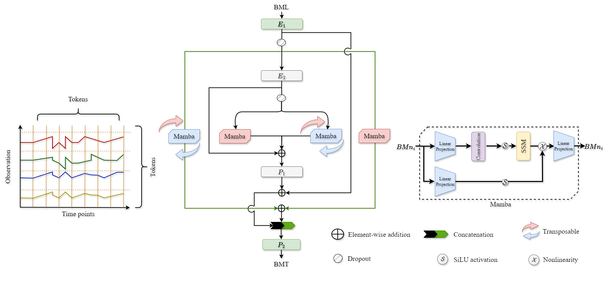

# <center>TimeMachine</center>


### Welcome to the official repository of: [TimeMachine: A Time Series is Worth 4 Mambas for Long-term Forecasting](https://arxiv.org/pdf/2403.09898.pdf). 
## :triangular_flag_on_post: TimeMachine is accepted to [**ECAI**](https://www.ecai2024.eu/) 
## Usage

1. Install requirements. ```pip install -r requirements.txt```

2. Navigate through our example scripts located at ```./scripts/TimeMachine```. You'll find the core of TimeMachine in ```models/TimeMachine.py```. For example, to get the multivariate forecasting results for weather dataset, just run the following command, and you can open ```./result.txt``` to see the results once the training is completed. Moreover, the results will also be available at ```csv_results```, which can be utilized to make queries in the dataframe:
```
sh ./scripts/TimeMachine/weather.sh
```

Hyper-paramters can be tuned based upon needs (e.g. different look-back windows and prediction lengths). TimeMachine is built on the popular [PatchTST](https://github.com/yuqinie98/PatchTST) framework.


## Acknowledgement

We are deeply grateful for the valuable code and efforts contributed by the following GitHub repositories. Their contributions have been immensely beneficial to our work.
- Mamba (https://github.com/state-spaces/mamba)
- PatchTST (https://github.com/yuqinie98/PatchTST)
- iTransformer (https://github.com/thuml/iTransformer)
- RevIN (https://github.com/ts-kim/RevIN)
- Reformer (https://github.com/lucidrains/reformer-pytorch)
- Informer (https://github.com/zhouhaoyi/Informer2020)
- FlashAttention (https://github.com/shreyansh26/FlashAttention-PyTorch)
- Autoformer (https://github.com/thuml/Autoformer)
- Stationary (https://github.com/thuml/Nonstationary_Transformers)
- Time-Series-Library (https://github.com/thuml/Time-Series-Library)


## Citation

If you find this repo useful in your research, please consider citing our paper as follows:

```
@article{timemachine,
  title     = {TimeMachine: A Time Series is Worth 4 Mambas for Long-term Forecasting},
  author    = {Ahamed, Md Atik and Cheng, Qiang},
  journal   = {arXiv preprint arXiv:2403.09898},
  year      = {2024}
}
```

